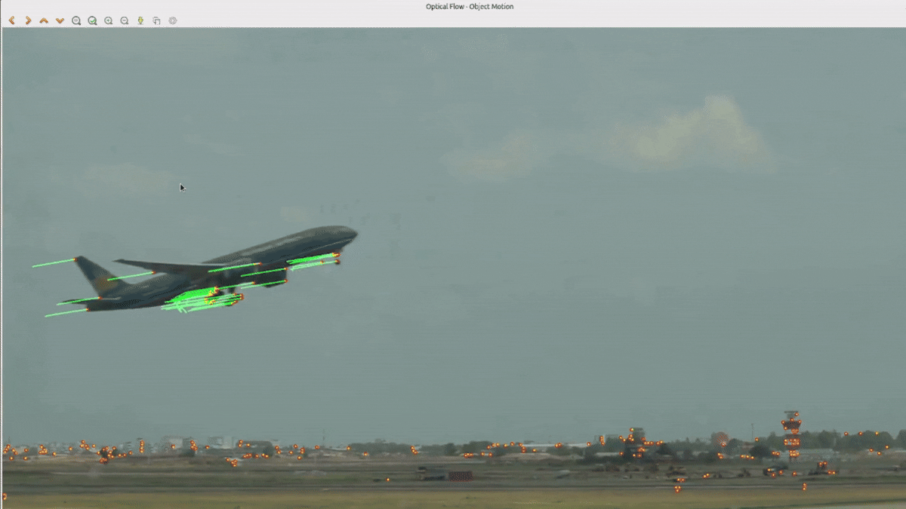

# Optical-Flow-Lucas-Kanade

This project focuses on **motion estimation of a single rigid object** in a video sequence using **optical flow**.
The movement is estimated using the **Lucas–Kanade pyramidal method**, and the **global trajectory, speed, and direction** of the object are analyzed.

The project was developed as part of a **Computer Vision / Image Processing** course to apply fundamental concepts of motion estimation.


## Features

* Motion estimation of a **single rigid object**
* Automatic detection of **feature points (Shi–Tomasi)**
* Optical flow computation using **Lucas–Kanade pyramidal approach**
* Visualization of the **motion field (displacement vectors)**
* Extraction of the **global trajectory** of the object
* Analysis of **average speed and movement direction**

---

## Tools Used

[](https://www.python.org)
[](https://numpy.org)
[](https://opencv.org)
[](https://matplotlib.org)
[](https://jupyter.org/)
[](https://www.anaconda.com/)


## How to Use This Repository

1. Clone the repository:

   ```bash
   git clone https://github.com/m-belefqih/Optical-Flow-Lucas-Kanade.git
   cd Optical-Flow-Lucas-Kanade
   ```

2. Create a virtual environment:

   ```bash
   python3 -m venv venv
   ```

3. Activate the virtual environment:

   ```bash
   source venv/bin/activate  # On Windows: venv\Scripts\activate
   ```

4. Install the required dependencies:

   ```bash
   pip install opencv-python numpy matplotlib
   ```

5. Run the script:

   ```bash
   python3 main.py
   ```

* Press **ESC** to stop the video playback.

## Sample output



## How It Works

* Detects **feature points** in the first frame using **Shi–Tomasi Corner Detection**
* Converts video frames to **grayscale** to enable optical flow computation
* Tracks the motion of detected points between consecutive frames using the **Lucas–Kanade Optical Flow (pyramidal approach)**
* Filters valid tracked points using the **status vector (`st`)**
* Estimates the **global position of the object** by computing the barycenter of the tracked points
* Stores the object’s position over time to extract its **trajectory**
* Visualizes the **motion field** by drawing displacement vectors on the video frames
* Overlays motion vectors on the original frame for intuitive visualization

## Results

- **Average speed:** 5.94 pixels/frame  
- **Average direction:** 0.26 radians (≈ 14°)  

These results are computed from the global trajectory extracted using Lucas–Kanade optical flow and represent the dominant motion of the tracked rigid object.

---

## 📃 License

This project is intended for **educational and academic purposes only.**
